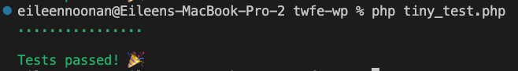
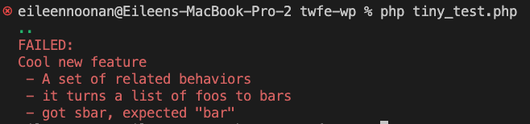

# Tiny Test

A tiny drop-in PHP testing library with no dependencies that you can customize on your own. Tiny Test is meant for PHP developers who want quick feedback without the overhead of large testing frameworks.

---

I work on a lot of wordpress sites and plugins, and I always feel weird pulling in something like PHPUnit or Pest when all I really want to do is make a few simple assertions.

As of this writing, Tiny Test is 100 lines of PHP that lets me do just that:





## How do I use it?

Drop it in the root of your project, create a directory called "tests", and put your tests into files that end in `_test.php`.

Then run the following command:

> `php tiny_test.php`

Tiny Test will recursively scan the directory for files matching that naming convention, then run your tests. It will bail on the first error.

## What do my tests look like?

While your tests may look different, _my_ test files look like this:

```php
// tests/foo_to_bar_test.php

// If this file is called directly, abort. (Useful for wordpress)
if (php_sapi_name() !== 'cli') {
	die( "We're sorry, but you can not directly access this file.\n" );
}

use function enu\tiny_test\{suite, describe, test, tiny_assert as assert};

use MyThing\FooToBar;

return suite("Cool new feature", function() {
  return [

    describe("A set of related behaviors", function() {
      return [

        test("it turns one foo to bar", function() {
          $input = "foo";
          $output = FooToBar::turn_foos_to_bars($input);

          assert($output === "bar", "Should have turned foo to bar");
        }),

        test("it turns a list of foos to bars", function() {
          $input = ["foo", "foo", "foo"];
          $output = FooToBar::turn_foos_to_bars($input);

          assert(count($output) === count($input));

          array_map(
            fn ($val) => assert($val === "bar", "got $val, expected \"bar\""),
            $output
          );
        })
      ];
    })
  ];
});

```

## Can I configure it?

A bit! Since you just paste in the `tiny_test.php` file, you can edit it to your heart's content. There is a bootstrap function at the top which declares the location of the tests directory. You can do other things in there like `require 'vendor/autoload.php'` etc.

Truly you can do whatever you want with it.
